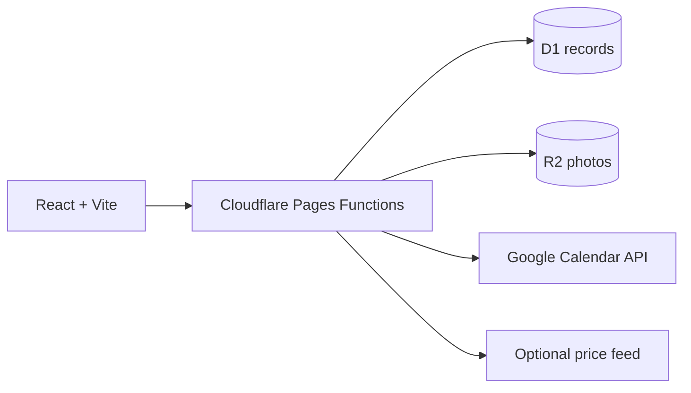

# Nhà Mình · Family Hub

A multilingual family operations app for the small decisions that add up: who needs to do what, what is already at home, how money is allocated, and whether a planned purchase is actually a good deal.

**Feedback welcome:** Use the [in-app feedback form](#feedback) on the public sign-in page. Suggestions are stored privately for the project owner. 

[Hướng dẫn triển khai bằng tiếng Việt](docs/README.vi.md)

## What it does

| Area | Features |
| --- | --- |
| Finance | Income and spending by person/category, editable 1–12 money jars totaling 100%, tax and claim tracking, savings, large-expense markers. |
| Family | Shared to-dos grouped by member, editable profiles with photos, interests and favorite colors, family calendar with Google Calendar OAuth. |
| Home | Pantry and household inventory, stock updates, recurring meals, shopping lists, wardrobe photo catalog. |
| Wishes | Shopping wishlist with tags such as makeup, home decor and hobby, plus travel and someday-to-do lists. |
| Prices | Saved offers with store, source, expiry, discount and unit-price display; matches shopping needs. Optional licensed JSON feed integration. |
| Language | Vietnamese, English, French, Dutch and Danish interface selection. |

The site is public, but household data and photos require Google sign-in from an explicitly configured email allowlist. Adding a member profile does **not** grant account access.

## Architecture



- OAuth uses a state cookie; sessions are HttpOnly/Secure and restricted to configured email addresses.
- Google refresh tokens are encrypted with AES-GCM before storage.
- Feedback has a honeypot and daily per-visitor rate limit; only signed-in family accounts can read submissions.
- The interface uses lightweight CSS transitions and honors `prefers-reduced-motion`.

## Run checks

```bash
npm ci
npm run check
npm test
npm run build
```

CI runs these checks on pushes and pull requests. The backend also uses SQLite migrations in `backend/migrations/`.

## Deploy from GitHub

1. Push this repository as **public** to show the code in your portfolio, then connect it to **Cloudflare Pages**. Only source and sample configuration belong in the repository.
2. Set build command `npm run build`, output directory `dist`, root `/`.
3. Create a D1 database and R2 bucket. Apply `0001_init.sql`, then `0002_family_features.sql` in that order. Bind them as `DB` and `BUCKET` in Pages.
4. Enable the Google Calendar API and create a Google OAuth **Web application**. Register the exact redirect URI `https://<your-pages-domain>/api/auth/callback`.
5. In Pages Secrets, set `GOOGLE_CLIENT_ID`, `GOOGLE_CLIENT_SECRET`, `ALLOWED_EMAILS`, `TOKEN_ENCRYPTION_KEY`, and `FEEDBACK_SALT`. An optional `FAMILY_CALENDAR_ID` points to a Google calendar shared with the allowed accounts.
6. Deploy again after configuring bindings and secrets. See the [full Vietnamese setup guide](docs/README.vi.md) for details and caveats about Google's Testing mode.

Never commit secrets, actual family photos, health records or exported databases. `frontend/` contains the UI, `backend/src/` contains API logic, and `functions/api/[[path]].js` mounts the API on the same origin.

## Price data and limitations

The project links to official Netto, REMA 1000, føtex and Bilka leaflets. Families can enter checked prices, which are dated and linked to their source. **No automatic supermarket feed is bundled.** If you have permission to use a price provider, configure `SALES_FEED_URL` and optionally `SALES_FEED_TOKEN`; the expected JSON format is documented in the [setup guide](docs/README.vi.md). The app does not declare a universal “cheapest store” without comparable coverage and pack sizes.

Garmin sync, receipt OCR, GPT chat, biological-age calculations and automated outfit suggestions are future integrations. ChatGPT Plus does not include an API key for the website.

## Feedback

The public sign-in page includes a short feedback form. Submissions are visible to authorized family accounts under **Family**. To contact the maintainer directly, you can also open a GitHub issue once the repository is available. Please do not include personal health or financial information in public issues.

## Portfolio summary

Built a multilingual full-stack family operations app with configurable budgeting, shared tasks, household inventory, wishlists, source-aware price tracking and Google Calendar OAuth; implemented access controls, encrypted tokens, database migrations and API tests.
